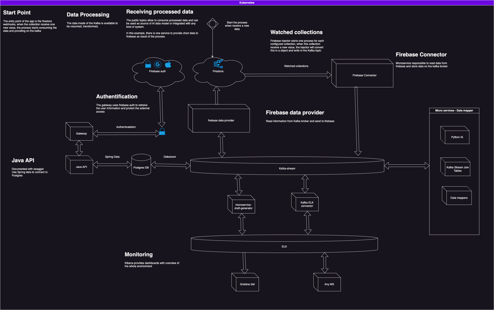

# Matrix View Documentation

> The Matrix View backend is responsible to listen firebase changes, provide information on the Kafka broker and work with this data

The backend is divided in several layers around a Kafka broker and can be enhanced with any resources of kubernetes

---
## Modules

This project was designed to demonstrate:

* [Infra](infra)
* TODO add others

---

## Documentation

### Overview

---

<!-- Markdown link & img dfn's -->

[public-url]: https://francisco-oliveira.web.app

[ng-fire]: https://www.npmjs.com/package/@angular/fire

[header-url]: github-template.png
[header-link]: https://github.com/EliasOliveira

[repository-url]: https://github.com/EliasOliveira/dashboard-node

[cloud-provider-url]: https://console.firebase.google.com/u/0/project/francisco-oliveira

[linkedin-url]: https://www.linkedin.com/in/junior-oliveira-dev/

[primeng-url]: https://primeng.org

[version-image]: https://img.shields.io/badge/Version-1.0.0-brightgreen?style=for-the-badge&logo=appveyor
[version-url]: https://img.shields.io/badge/version-1.0.0-green
[Frontend-image]: https://img.shields.io/badge/Frontend-Angular-blue?style=for-the-badge
[Frontend-url]: https://img.shields.io/badge/Frontend-Angular-blue?style=for-the-badge

[repository-url-java]: https://github.com/EliasOliveira/dashboard-java
[repository-url-angular]: https://github.com/EliasOliveira/dashboard-angular
[repository-url-vue]: https://github.com/EliasOliveira/dashboard-vue
[repository-url-react]: https://github.com/EliasOliveira/dashboard-react

