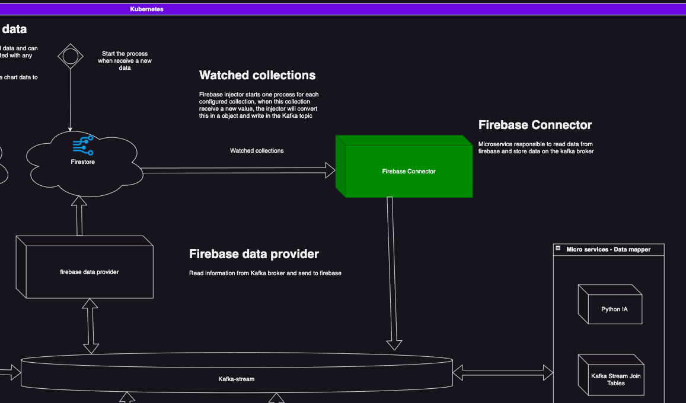

# Matrix View Microservices - Firebase Connector


> The Matrix View Firebase Connector is responsible to listen firebase changes, convert the data in Kafka format and write on the Kafka broker

---
## Configuration

The service can be configured using the following steps:

### Helm

#### Config map
```yaml
apiVersion: v1
kind: ConfigMap
metadata:
  name: config
data:
  config.json: |
    {
      "kafka-broker": "kafka-broker.default.svc.cluster.local:9092",
      "port": 80,
      "collections": [
        {
          "collection": "data",
          "topic": "data"
        }
      ]
   
```

#### Deployment
```yaml
apiVersion: apps/v1
kind: Deployment
metadata:
  name: {{ template "helm-guestbook.fullname" . }}
  labels:
    app: {{ template "helm-guestbook.name" . }}
    chart: {{ template "helm-guestbook.chart" . }}
    release: {{ .Release.Name }}
    heritage: {{ .Release.Service }}
spec:
  replicas: {{ .Values.replicaCount }}
  revisionHistoryLimit: 3
  selector:
    matchLabels:
      app: {{ template "helm-guestbook.name" . }}
      release: {{ .Release.Name }}
  template:
    metadata:
      labels:
        app: {{ template "helm-guestbook.name" . }}
        release: {{ .Release.Name }}
    spec:
      volumes:
        - name: config
          configMap:
            name: config
      containers:
        - name: {{ .Chart.Name }}
          image: "{{ .Values.image.repository }}:{{ .Values.image.tag }}"
          imagePullPolicy: {{ .Values.image.pullPolicy }}
          env:
            - name: FIREBASE_SERVICE_ACCOUNT
              valueFrom:
                secretKeyRef:
                  name: firebase
                  key: service_account
          volumeMounts:
            - name: config
              mountPath: /configuration
          ports:
            - name: http
              containerPort: {{ .Values.containerPort }}
              protocol: TCP
          livenessProbe:
            httpGet:
              path: /
              port: http
          readinessProbe:
            httpGet:
              path: /
              port: http

```


---

## Documentation

### Overview



---


<!-- Markdown link & img dfn's -->

[public-url]: https://francisco-oliveira.web.app

[ng-fire]: https://www.npmjs.com/package/@angular/fire

[header-url]: github-template.png
[header-link]: https://github.com/EliasOliveira

[repository-url]: https://github.com/EliasOliveira/dashboard-node

[cloud-provider-url]: https://console.firebase.google.com/u/0/project/francisco-oliveira

[linkedin-url]: https://www.linkedin.com/in/junior-oliveira-dev/

[primeng-url]: https://primeng.org

[version-image]: https://img.shields.io/badge/Version-1.0.0-brightgreen?style=for-the-badge&logo=appveyor
[version-url]: https://img.shields.io/badge/version-1.0.0-green
[Frontend-image]: https://img.shields.io/badge/Frontend-Angular-blue?style=for-the-badge
[Frontend-url]: https://img.shields.io/badge/Frontend-Angular-blue?style=for-the-badge


[repository-url-java]: https://github.com/EliasOliveira/dashboard-java
[repository-url-angular]: https://github.com/EliasOliveira/dashboard-angular
[repository-url-vue]: https://github.com/EliasOliveira/dashboard-vue
[repository-url-react]: https://github.com/EliasOliveira/dashboard-react


