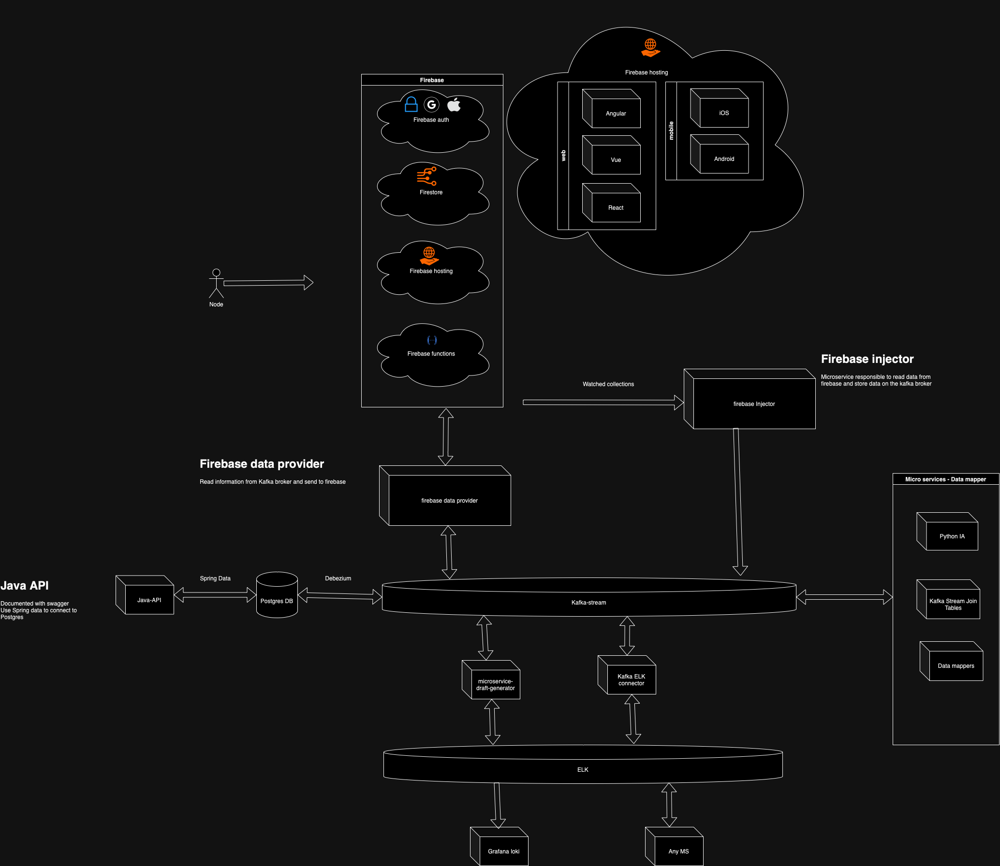

# Matrix View Infrastructure

> Infra based on kubernetes to support the services and resources


---

# Installation
### Pre Requisites
 
 - Kubernetes cluster
 - Helm
 - Firebase account

## Environment configuration

Create a secret inside of the kubernetes adding your firebase service account, you can follow the next example:

```yaml
apiVersion: v1
kind: Secret
metadata:
  name: firebase
type: Opaque
data:
  service_account: "SERVICE ACCOUNT AS BASE64"
```
### Apply to k8s

``` sh
kubectl -n default apply -f secrets/firebase.yaml
```

### Get from from k8s

``` sh
kubectl -n default describe secret firebase
```

### Delete secret

``` sh
kubectl -n default delete secret firebase
```


---
# Documentation
## Big picture



